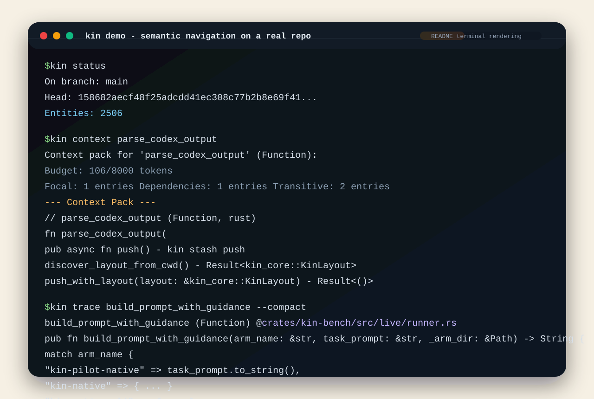

<p align="center">
  <picture>
    <source media="(prefers-color-scheme: dark)" srcset=".github/kin-lockup-dark.png">
    <source media="(prefers-color-scheme: light)" srcset=".github/kin-lockup-light.png">
    
  </picture>
</p>

# Kin

**Git stores text history. Kin understands code.**

Kin is the semantic system of record for software work. It replaces the file-first, diff-first repository model with a graph of semantic entities and relationships, then serves precise context to AI agents and developers. Kin is not a coding assistant or a Git wrapper -- it is a sovereign VCS and the semantic operating layer that any assistant can use. `kin init` works with or without `.git`.

Latest checked result: on a validated 10-repo Codex CLI sweep, `kin-native` won `69/70` task comparisons while using `50.0%` less wall-clock time and `44.6%` fewer tokens than raw Git exploration. The benchmark methodology, per-repo matrix, and caveats are published in [docs/benchmarks/validated-popular-repos-2026-03-20.md](docs/benchmarks/validated-popular-repos-2026-03-20.md).

> **Alpha** -- Kin is in active development. The core thesis is proven (1,400+ tests, validated benchmarks, working brownfield migration), but APIs and CLI surface will evolve. Standalone source builds now work from this repo directly; Cargo will fetch the current `kin-db` / `kin-model` dependency set from the `kin-db` repo. Prebuilt release artifacts are still the easiest way to try the CLI.

[](https://github.com/firelock-ai/kin/actions/workflows/ci.yml)
[](https://codecov.io/gh/firelock-ai/kin)
[](LICENSE)
[](https://www.rust-lang.org/)
[](#status)

---

## Proof

Kin is making a measurable claim, not a branding claim.

- **Validated benchmark sweep** -- `69/70` wins across 10 popular repos and 70 checked task comparisons
- **Speed** -- `50.0%` less wall-clock time overall (`1659.7s` for Git vs `829.8s` for Kin-native)
- **Efficiency** -- `44.6%` fewer tokens overall (`5,539,366` for Git vs `3,068,820` for Kin-native)
- **Breadth** -- Express, Axios, Hono, Zod, Flask, Typer, Requests, Redux, Click, and Day.js
- **Validation** -- randomized planted artifacts, identical prompts, automatic scoring, and published raw run artifacts

Read the checked benchmark summary: [docs/benchmarks/validated-popular-repos-2026-03-20.md](docs/benchmarks/validated-popular-repos-2026-03-20.md).

---

## Demo

<p align="center">
  
</p>

This is a terminal rendering built from excerpted real CLI output on the `kin` codebase itself. The point is the workflow shape: `kin status` exposes semantic repo state, `kin context` builds a token-budgeted pack, and `kin trace` resolves one entity plus its nearby graph neighborhood in a single hop.

---

## Why Kin?

- **The file-first model is the bottleneck** -- AI agents should not have to repeatedly reconstruct software structure from files, line diffs, grep passes, and transient context windows. Kin makes semantic truth primary and treats files as projections.
- **Precise context delivery** -- Graph-traversal context under token budgets, not file dumping. AI assistants get exactly the entities they need, with signatures for dependencies.
- **Identity tracking across refactors** -- Semantic fingerprints survive renames, moves, and formatting changes. Kin knows `processOrder` and `handle_order` are the same function.
- **Semantic review** -- Review changed entities and their impact graph, not line diffs. See what a change actually affects.
- **Provenance and trust** -- Every change carries evidence of who or what made it and why, with full execution traces.
- **Git interop** -- Import from Git, export to Git, but Git is not required. Kin adoption is reversible: delete `.kin/` and your source files remain untouched.
- **Measurable results** -- The latest checked sweep came in at `69/70` wins, `50.0%` less wall-clock time, and `44.6%` fewer tokens against validated Git-based exploration.

---

## Quick Start

```bash
# Prerequisites: Rust stable (2021 edition)
git clone https://github.com/firelock-ai/kin.git
cd kin
cargo install --locked --path crates/kin-cli

# Initialize a project
kin init /path/to/your/project
cd /path/to/your/project

# See semantic state
kin status

# Trace entity relationships
kin trace <entity>
```

If you only want to use Kin, prefer the release binaries published on the GitHub Releases page. If `kin` is not on your `PATH` after `cargo install`, add Cargo's bin directory (usually `~/.cargo/bin`).

---

## Key Workflows

You do not need to memorize a huge command catalog to get value from Kin. Most day-one usage falls into four workflows:

| Workflow | Start Here | What You Get |
|---------|------------|--------------|
| Understand one symbol fast | `kin trace`, `kin context`, `kin refs`, `kin impact` | Resolve a focal entity, build a narrow context pack, inspect callers/importers, and see downstream blast radius |
| Review and verify changes | `kin diff`, `kin review`, `kin verify`, `kin audit` | Entity-level change review, semantic risk signals, coverage checks, and provenance |
| Work in native mode | `kin mode`, `kin with`, `kin open`, `kin reconcile`, `kin exec` | Materialized workspaces, Kin-guided assistant sessions, and graph-backed reconciliation |
| Adopt without a flag day | `kin init`, `kin git import`, `kin git export`, `kin remote`, `kin push`, `kin pull`, `kin mcp` | Brownfield migration, Git coexistence, remotes, and assistant-neutral integration |

For the full CLI surface, run `kin --help` and `kin <command> --help`.

---

## Language Support

Tier 1 -- full entity extraction, relation extraction, fingerprinting, and contract adapters:

- TypeScript / JavaScript
- Python
- Go
- Java
- Rust

Parsing is powered by Tree-sitter with per-language adapters.

---

## MCP Integration

Kin exposes its semantic graph through the [Model Context Protocol](https://modelcontextprotocol.io/), making it assistant-neutral. Any MCP-compatible tool -- Claude Code, Codex, Gemini CLI, Cursor, or others -- can query semantic search, impact analysis, dead code detection, review state, and more.

Start the MCP server with `kin mcp` or configure it as an MCP server in your assistant's settings.

---

## Benchmarks

We benchmark Kin against raw Git exploration using a **validated** task suite, not hand-picked demos.

Latest checked sweep:

- 10 popular open source repos (Express, Axios, Hono, Zod, Flask, Typer, Requests, Redux, Click, Day.js)
- 70 validated task comparisons (7 tasks x 10 repos)
- Assistant: Codex CLI 0.114.0
- Result: **69/70 wins**, **50.0% less wall-clock time**, **44.6% fewer tokens**

Important caveats:

- This checked sweep covered JavaScript, TypeScript, and Python only. Rust was excluded from the published matrix.
- The run used one assistant configuration and one repetition per repo.
- The checked run was not on a lab-clean machine; see the linked methodology doc for the exact caveats and environment notes.

### How We Keep It Fair

- Same assistant binary, same machine, same repo snapshot, same task set for both arms.
- Every run uses `--fresh-conversion` -- Kin rebuilds its graph from scratch.
- Planted artifacts carry random tags and secret values -- the assistant cannot answer from training data.
- Validation is automatic against planted ground truth. No manual scoring.
- Conversion cost is reported separately from per-task timings.

Full benchmark methodology and per-repo results: [docs/benchmarks/validated-popular-repos-2026-03-20.md](docs/benchmarks/validated-popular-repos-2026-03-20.md). Reproducing the sweep locally will write raw run artifacts under `.kin/bench/`.

```bash
# Reproduce
cargo build --release -p kin-cli
python3 scripts/run_popular_validated_benchmarks.py --assistant codex
```

---

## Architecture Overview

Kin organizes code understanding into four planes:

```
┌─────────────────────────────────────────────────────────────┐
│                     SEMANTIC PLANE                          │
│  Entities, Relations, Contracts, SemanticChanges, Specs     │
│  ↕ source of truth                                          │
├─────────────────────────────────────────────────────────────┤
│                     PROJECTION PLANE                        │
│  Source files, Git commits, PR views, Living docs           │
│  ↕ rendered from semantic state                             │
├─────────────────────────────────────────────────────────────┤
│                     EXECUTION PLANE                         │
│  Local workspaces, Validation runs, Evidence capture        │
│  ↕ proves correctness                                       │
├─────────────────────────────────────────────────────────────┤
│                     CONTROL PLANE                           │
│  Reviews, Governance, Assistant adapters, Benchmarks        │
│  ↕ manages quality and trust                                │
└─────────────────────────────────────────────────────────────┘
```

**Semantic entities** are the source of truth. Files are projections of semantic state -- rendered outputs, not primary artifacts. The embedded [KinDB](https://github.com/firelock-ai/kin-db) graph engine stores topology, metadata, signatures, and fingerprints. A content-addressable blob store holds raw code text.

---

## Crate Architecture

Kin is built as 18 Rust crates in this workspace plus the shared `kin-model` crate shipped from the [kin-db](https://github.com/firelock-ai/kin-db) repo. Key crates:

| Crate | Description |
|-------|-------------|
| `kin-cli` | CLI with full command set |
| `kin-daemon` | Background service: file watch, incremental indexing, reconciliation |
| `kin-core` | Shared runtime, config, error types |
| `kin-model` | Canonical types: Entity, Relation, Contract, SemanticChange, Spec (consumed from the [kin-db](https://github.com/firelock-ai/kin-db) repo) |
| `kin-db` | Embedded graph engine (released in tandem as [its own repo](https://github.com/firelock-ai/kin-db)) |
| `kin-parser` | Tree-sitter parsing and language adapters |
| `kin-context` | Token-budgeted context pack builder with semantic slicing |
| `kin-mcp` | MCP server -- assistant-neutral integration surface |

---

## Status

Kin is in **public alpha**.

**What's solid:**
- Core data model (Entity, Relation, SemanticChange, Fingerprint)
- Embedded graph database ([KinDB](https://github.com/firelock-ai/kin-db)) with snapshot persistence and read indexes
- Content-addressable blob store
- Tree-sitter parsing pipeline for all Tier 1 languages
- CLI command structure and routing
- Git import/export adapter
- MCP server protocol
- Validated benchmark suite (69/70 wins against Git-based exploration)

**What's still hardening:**
- Reconciliation loop edge cases (broken ASTs, partial parses)
- Semantic merge conflict resolution
- Multi-workspace coordination
- Performance optimization on large repos (100k+ entities)
- Living docs projection

We ship what works and are transparent about what doesn't yet. If you hit a rough edge, [open an issue](https://github.com/firelock-ai/kin/issues).

---

## Ecosystem

Only `kin` and `kin-db` are shipping in this public alpha. The rest of the stack is supporting infrastructure or planned follow-on surfaces.

| Component | Status | Description |
|-----------|--------|-------------|
| **[kin](https://github.com/firelock-ai/kin)** | Shipping now | Semantic VCS (this repo) |
| **[kin-db](https://github.com/firelock-ai/kin-db)** | Shipping now | Apache-licensed graph engine substrate |
| **kin-code** | Planned | Editor shell |
| **kin-pilot** | Planned | Agent shell |
| **[KinLab](https://kinlab.ai)** | Planned | Hosted collaboration layer |

---

## Contributing

See [CONTRIBUTING.md](CONTRIBUTING.md) for build instructions, PR process, and code style guidelines.

## Security

See [SECURITY.md](SECURITY.md) for vulnerability reporting.

## License

Kin is licensed under the **Apache License 2.0**. See [LICENSE](LICENSE) for the full text.

[KinDB](https://github.com/firelock-ai/kin-db), the embedded graph engine under Kin, is also **Apache-2.0**.

---

Created by [Troy Fortin](https://www.linkedin.com/in/troy-fortin-jr/) at [Firelock, LLC](https://firelock.ai).

---

*"So neither the one who plants nor the one who waters is anything, but only God, who makes things grow." -- 1 Corinthians 3:7*
