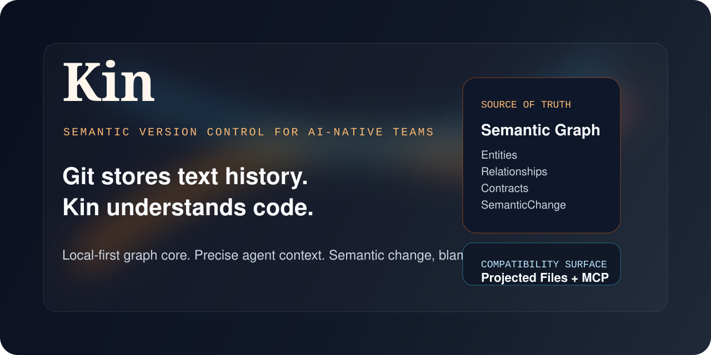
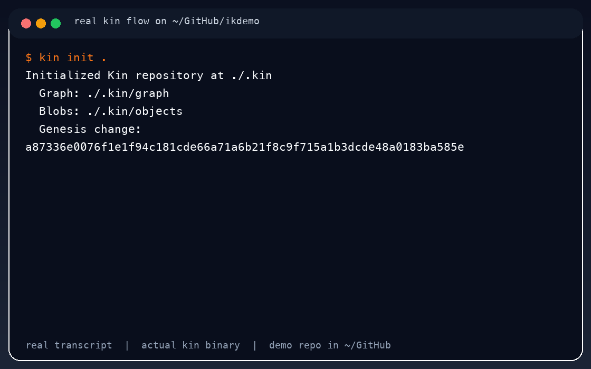
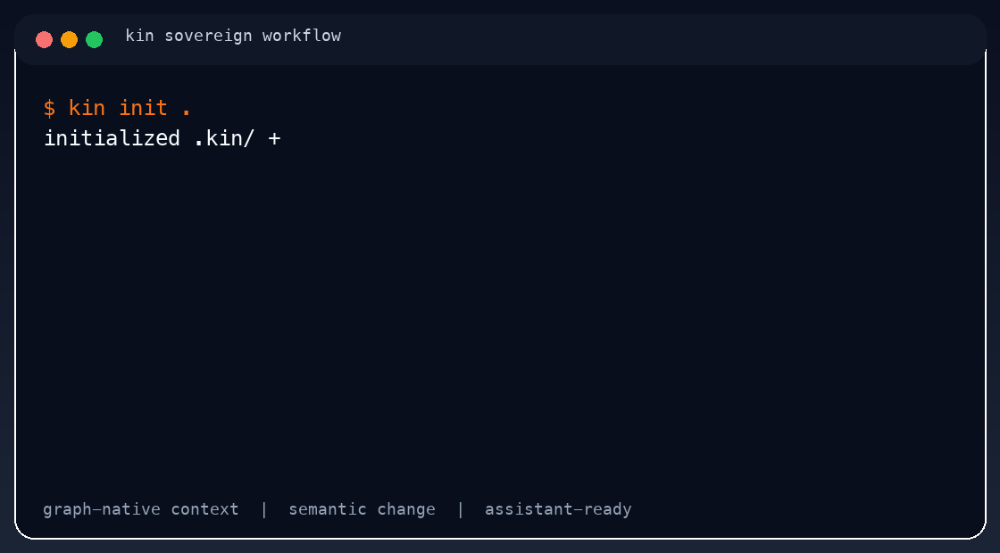
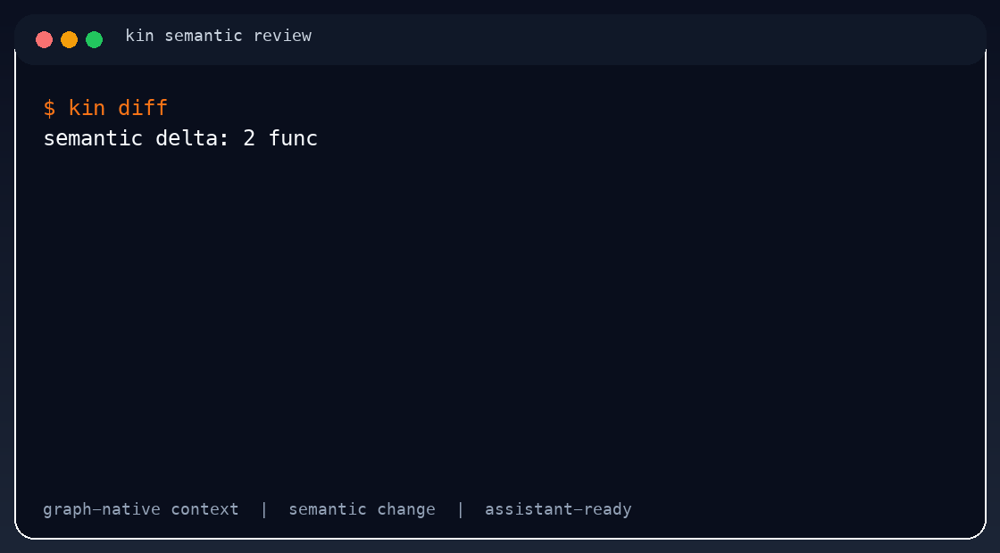
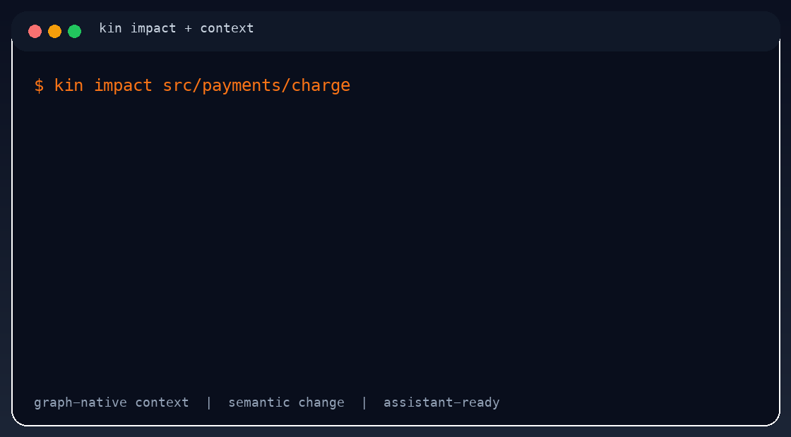
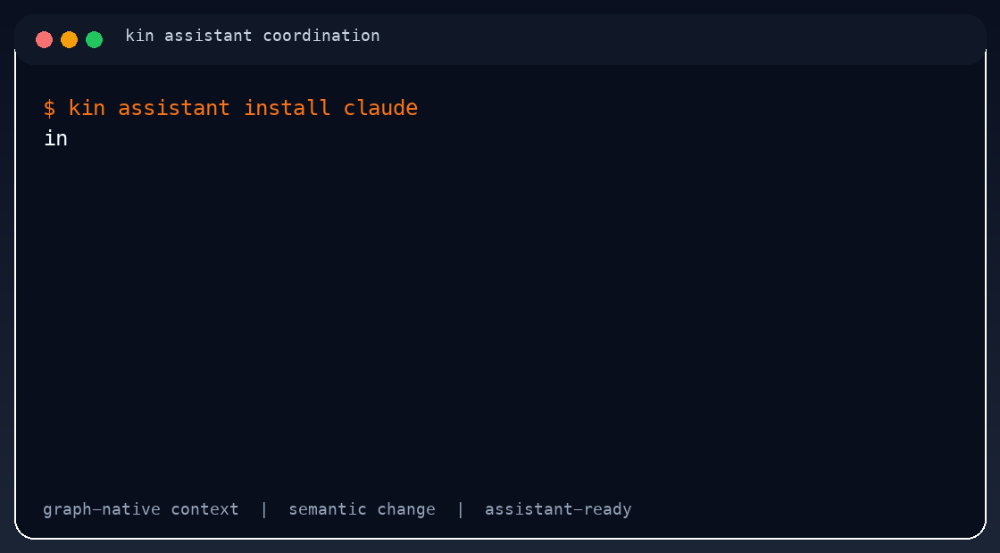
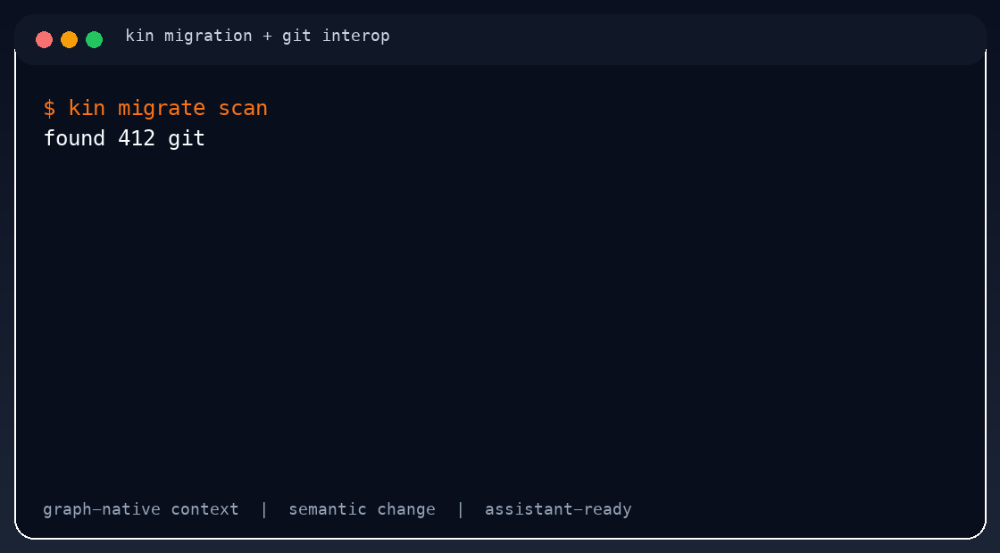

# Kin



**Local-first semantic version control for AI-native teams**

> Git stores text history. Kin understands code.

Kin is a sovereign VCS that replaces file-based version control with a graph of semantic entities, relationships, contracts, and `SemanticChange` history. It serves precise, token-budgeted context to AI agents and developers through a CLI, daemon, MCP server, and local UI. `kin init` works with or without `.git`.

**Open core, shipping now:**
- sovereign local-first repo initialization
- semantic graph + blob store + projection engine
- CLI, daemon, MCP server, local UI
- Git import/export/sync as an adapter, not a dependency

Start here:
- **[Architecture](./docs/architecture/kin-system-architecture.md)**
- **[Pitch Deck](./docs/pitch/kin-deck.md)**
- **[Social Preview Asset](./docs/pitch/kin-social-preview.png)**

## Why This Exists

AI agents are colliding with a developer stack built for files, folders, and line diffs.

That breaks in predictable ways:

- agents over-read and under-understand
- refactors lose identity
- blame and review stop at line numbers
- monorepos become a context workaround
- Git becomes the bottleneck instead of the adapter

Kin changes the substrate:

- the **graph** stores semantic identity and topology
- the **blob store** holds content
- **files are projections**
- **agents talk to Kin directly** through MCP and local APIs
- **Git is optional interop**, not the center of the system

## Git vs Kin

| Problem | Git | Kin |
| --- | --- | --- |
| Source of truth | files and line diffs | semantic graph + content blobs |
| Refactor identity | fragile | persistent via fingerprints |
| Agent context | broad file retrieval | targeted semantic packs |
| Review surface | text patches | semantic impact and evidence |
| Cross-boundary understanding | monorepo pressure | domain and contract awareness |
| Git dependence | mandatory | optional adapter |

## See Kin

**Real recorded flow on a real repo in `~/GitHub`:**



<table>
  <tr>
    <td><strong>Sovereign workflow</strong><br></td>
    <td><strong>Semantic review</strong><br></td>
  </tr>
  <tr>
    <td><strong>Impact and context</strong><br></td>
    <td><strong>Assistant coordination</strong><br></td>
  </tr>
  <tr>
    <td colspan="2"><strong>Migration and Git interop</strong><br></td>
  </tr>
</table>

## What You Get

- **Precise context delivery** instead of file dumping
- **Identity across refactors** through semantic fingerprints
- **Semantic diff, history, review, and impact analysis**
- **Provenance and evidence** for humans and agents
- **Assistant-neutral integration** through MCP and local APIs
- **Reversible adoption** because deleting `.kin/` leaves working files intact

## What Ships In The Open Core

This repository is the open local-first semantic core:

- `kin-cli`, `kin-daemon`, `kin-mcp`, and `apps/kin-local-ui`
- `kin-model`, `kin-core`, `kin-graph`, and `kin-blobs`
- `kin-parser`, `kin-index`, `kin-projection`, and `kin-reconcile`
- `kin-context`, `kin-contracts`, and `kin-review`
- `kin-git`, `kin-migrate`, `kin-bench`, and `kin-runtime`

## Getting Started

- Rust toolchain
- Git, if you want to exercise Git interop flows

Common commands:

```bash
cargo test --workspace
cargo run -p kin-cli -- init .
cargo run -p kin-cli -- status
```

## Repo Layout

- `crates/` — Rust workspace for the semantic core
- `apps/kin-local-ui/` — local web UI
- `tests/integration/` — end-to-end acceptance coverage
- `docs/architecture/` — public architecture documentation
- `docs/pitch/` — public positioning and presentation material

Tier-1 language support in V1:

- TypeScript / JavaScript
- Python
- Go
- Java
- Rust

## Non-Negotiables

- Kin is the primary VCS. Git is an optional legacy adapter.
- KuzuDB is the query engine for graph operations.
- The graph stores topology and metadata; the blob store stores content.
- Tree-sitter is the parsing foundation, with LSP/SCIP enrichment where useful.
- Files are projections of semantic state, not the source of truth.
- The system is local-first by default.
- Deleting `.kin/` must leave the working directory intact and runnable.

## CLI Surface

Kin currently exposes the core semantic VCS and assistant-facing commands through `kin`:

```bash
kin init
kin status
kin commit
kin log
kin branch
kin merge
kin diff
kin stash
kin history
kin blame
kin impact
kin context
kin search
kin review
kin spec
kin bench
kin migrate
kin workspace
kin run
kin mcp
kin assistant
kin git import
kin git export
kin git sync
```

## Contributing

If you want to work on semantic version control, agent context infrastructure, graph-backed review, or the next generation of developer tooling, this is the right problem set.

## License

Apache 2.0
