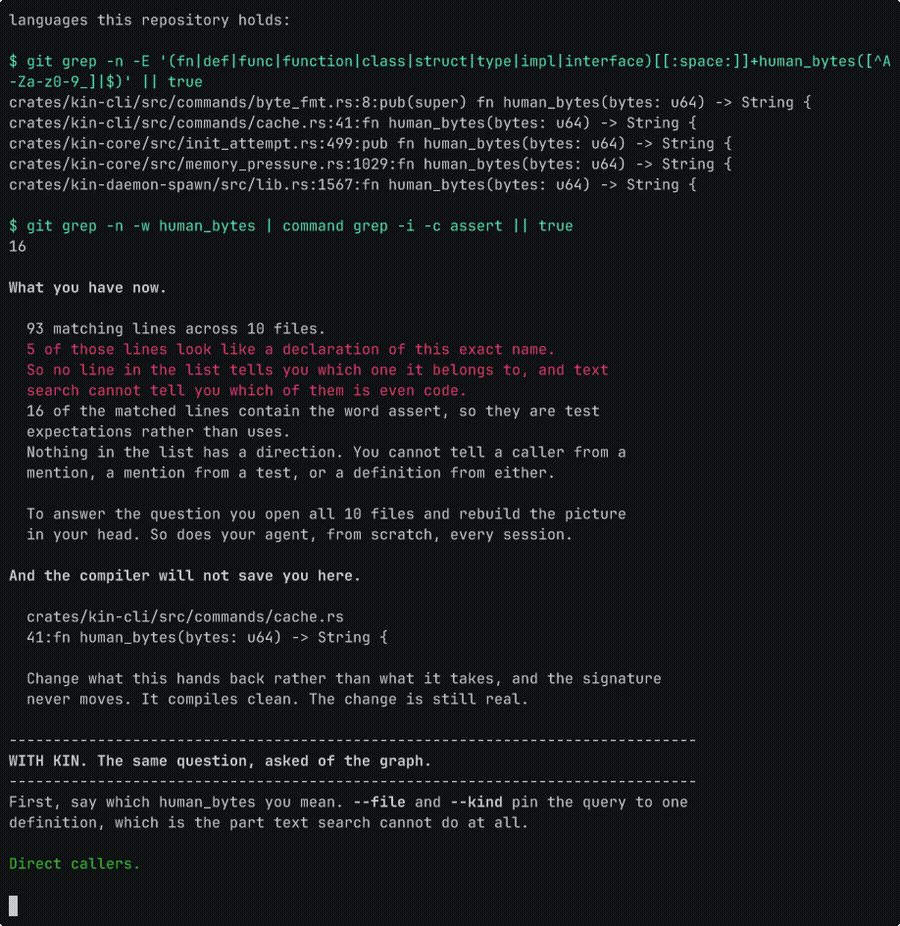

<p align="center">
  
</p>

<h3 align="center">AI changed who writes code.<br />Kin changes what they build on.</h3>

<p align="center">
  
</p>

<p align="center">
  <a href="LICENSE"></a>
  <a href="https://github.com/firelock-ai/kin/releases/latest"></a>
</p>

**Kin is an open-source code repository and version control system for people and AI agents.** It keeps track of how the code fits together, so you can investigate what a change might affect.

Functions, types, recorded relationships, and change history are repository data that you commit, branch, and merge. The graph is the repository model, not a separate index alongside Git. Exact source is preserved byte for byte, and filesystem projections let supported tools keep working with ordinary files.

A star helps other people find Kin, and [Discussions](https://github.com/firelock-ai/kin/discussions) is where to bring a question about it.

**Public alpha.** Start with a small repository you know well. Expect rough edges and breaking changes.

[Quickstart](#quickstart) · [Documentation](docs/quickstart.md) · [Browser demo](https://kinlab.ai/demo)

## See what connects

Before changing a shared function, what else should you inspect? Kin lets you look up its recorded callers and explore related code. The CLI and MCP server query the same graph, so you and your agent can work from the same record.


*Recorded on a prepared ripgrep graph at `e89fff89ac9af12e8d4ce9d5fd07beb408ca730f`. Raw run artifacts are not public. This illustrates a workflow, not a performance benchmark.*

## Use it from Claude Code, Codex or Cursor

For Claude Code:

```
/plugin marketplace add firelock-ai/kin
/plugin install kin@kin
```

For [Codex](plugins/kin-codex/README.md#install), add the marketplace and install the plugin, or let `kin setup --intent agent` write the MCP server into `~/.codex/config.toml` for you.

For Cursor, add the MCP server by hand; see [plugins/kin-cursor](plugins/kin-cursor/README.md#install) for the exact snippet.

After installing, run `kin init .` in a small repository you know well; the `kin-setup` skill walks you through the rest.

Kin is not published on crates.io. The `kin` crate there is an unrelated project.

## Quickstart

Use a disposable copy of a small Git repository. Import includes its full reachable history and can take substantial time and memory. **Shallow clones, submodules, and Git LFS are not supported.**

### 1. Install

On macOS or Linux, run the installer and finish its setup prompts:

```sh
curl -fsSL https://get.kinlab.dev/install | sh
```

After it finishes, reload your shell as a separate command:

```sh
exec "$SHELL" -l
```

For Windows, alternative installers, or troubleshooting, see the [full quickstart](docs/quickstart.md#1-install).

### 2. Initialize the repository

At the new prompt, replace the path below:

```sh
cd /path/to/your/repository &&
kin init . &&
kin overview &&
kin status
```

`kin overview` shows the entities Kin imported. `kin status` shows what was admitted and the working tree's state against it. `kin graph status` reports the daemon's live query graph and coverage. Uncommitted and untracked changes are not part of the imported Git history; `kin init` reports what it left out.

### 3. Ask a question you can check

Look for something you already know is in the code:

```sh
kin locate "<something you already know is in this repository>"
```

Replace `ExactEntityName` below with a symbol from the result:

```sh
kin refs ExactEntityName
kin trace ExactEntityName
kin impact ExactEntityName
```

`refs` returns recorded references, `trace` brings in nearby context, and `impact` explores potential effects through the graph. Check the results against the source.

### 4. Connect your agent

Prepare local embeddings, then configure detected MCP clients:

```sh
kin embed &&
kin setup --intent agent &&
kin setup status --json
```

Kin supports Claude Code, Codex, Cursor, Gemini, and other MCP clients. Use `kin setup --intent editor` for VS Code. Kin also includes `kin agent run` for local or hosted OpenAI-compatible model endpoints.

[Client configuration](docs/readme-reference.md#works-with-your-agent) · [MCP tools](docs/mcp-tools.md) · [Built-in agent](docs/cli-reference.md#kin-agent)

Local imports, storage, and queries run on your machine. Installation and the initial embedding-model download need network access. Before embeddings are ready, `kin locate` uses lexical and graph signals and reports the missing vector coverage.

## Review a change

After running `kin init` on the Git branch you want to review, compare explicit commit SHAs against `main`:

```sh
kin review shadow "$(git rev-parse main)..$(git rev-parse HEAD)"
```

The report returns `PASS`, `NEEDS ATTENTION`, or `WOULD BLOCK`, with graph-derived impact and supporting evidence. **It is advisory:** it does not block a merge or change graph state. Authorship is declared, not independently verified.

## Use Kin with or without Git

Kin has its own commits, branches, merges, diffs, and history, including in repositories with no Git underneath. Existing Git repositories can be imported, and supported workflows can export a new Git repository.

[Native version-control walkthrough](docs/readme-reference.md#version-control-without-git) · [Git interoperability and export limits](docs/readme-reference.md#how-kin-relates-to-git)

## Alpha limits

**Coverage is incomplete.** Supported languages are parsed into entities and relationships; other files remain available as content and history. An empty result does not prove there are no callers or dependencies. Keep using your compiler, tests, and review. See [language support](docs/language-support.md).

**Compatibility varies.** Filesystem projection has separate platform and tool restrictions. Check [platform notes](docs/readme-reference.md#platform-and-maturity) before relying on it.

**Preserve Kin-only state.** Deleting `.kin` and re-importing from Git does not recover commits, reviews, or other state that existed only in Kin. Read the [import, recovery, and upgrade notes](docs/readme-reference.md#what-is-real-today-and-what-is-alpha).

**Windows.** Native Windows x86_64 support is early. Repository admission works: `kin init` imports a Git repository and publishes graph authority, and graph, lexical, and daemon-backed queries answer natively. Transparent filesystem projection is not shipped on Windows, and the end-to-end install proof does not yet cover MCP or review workflows there, so WSL2 remains the recommended path for the full Kin experience.

## Why I built Kin

I kept watching coding agents piece together parts of a codebase we'd already worked through. Then I'd do a version of that work myself to review their changes. I started wondering why more of that structural understanding wasn't part of the repository itself.

That's what I'm building with Kin.

Troy

## Learn more and contribute

[CLI reference](docs/cli-reference.md) · [Architecture and detailed limits](docs/readme-reference.md) · [Contributing](CONTRIBUTING.md) · [Issues](https://github.com/firelock-ai/kin/issues/new/choose) · [Security](SECURITY.md)

Kin and its local stack, including [kin-db](https://github.com/firelock-ai/kin-db), are [Apache-2.0](LICENSE). [KinLab](https://kinlab.ai) is the separate proprietary hosted product. Public repository onboarding is still in development.
