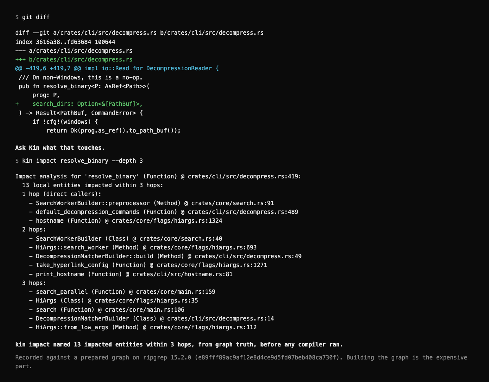
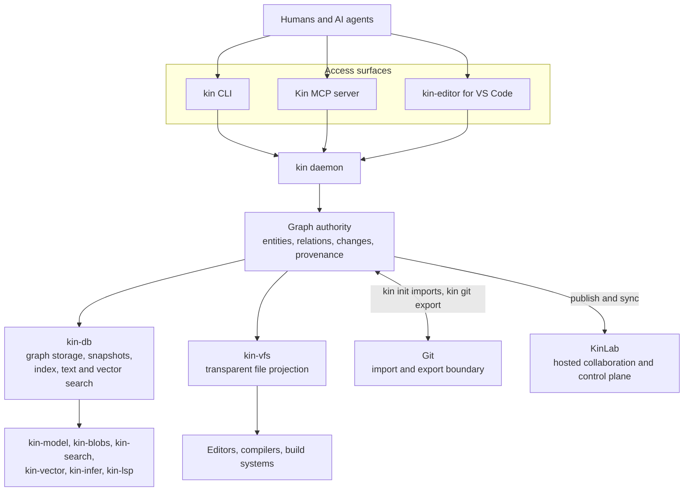

<p align="center">
  
</p>

<div align="center">

<h3>The diff is not the change.</h3>

[](LICENSE) [](https://github.com/firelock-ai/kin/releases/latest) [](https://kinlab.ai)

</div>

AI agents can write a change faster than a team can establish what it touches,
whether it reverses an earlier fix, and how far its consequences reach. Git
records files and line history. Kin records the software itself as a graph of
entities, relations, changes, and provenance, then gives humans and agents one
semantic authority to query and review. What a change touches shows up before
it merges, and agents work from exact context instead of re-reading the
repository.

Kin is the semantic system of record for AI-written software. It is a public
alpha, usable today as a local CLI, daemon, MCP server, review surface, and
graph-backed filesystem projection. It is pre-1.0, so expect rough edges and
breaking changes. See the [latest stable release](https://github.com/firelock-ai/kin/releases/latest)
and the [current limitations](#platform-and-maturity) before adopting it in a
critical workflow.

## See it on a real repository

A one-line signature change in ripgrep looks harmless in the diff. Ask
`kin impact` about it, before any compiler runs, and it names what the edit
reaches. The callers of the changed signature come first, then everything
those callers pull in behind them.

<p align="center">
  
</p>

Recorded against a prepared graph at ripgrep commit
`e89fff89ac9af12e8d4ce9d5fd07beb408ca730f`. A one-line signature edit, and Kin
surfaces the entities it affects before a compiler runs. The graph was built
beforehand. No compiler ran. Exact commands:
[kinlab.ai/proof](https://kinlab.ai/proof). The raw run directory is not
public yet, so this is a recipe you can re-run, not a trace you can audit.

Kin surfaces what the change touches. Whether the change is correct stays with
your compiler, tests, and review. The graph is built beforehand by `kin init`,
and building it is the expensive part; after that, impact questions are
answered from graph truth, not from re-reading the tree.

## The stack

Kin is one system with a few clear public surfaces:

| Surface | What it does |
| --- | --- |
| **[kin](https://github.com/firelock-ai/kin)** | Semantic system of record: CLI, daemon, graph lifecycle, MCP, review, provenance, and Git coexistence. |
| **[kin-vfs](https://github.com/firelock-ai/kin-vfs)** | Projects graph-owned files through normal filesystem calls so existing tools can keep using files. |
| **[kin-editor](https://github.com/firelock-ai/kin-editor)** | VS Code access to the entity explorer, semantic search, trace, review, and rename surfaces. |
| **[Kin MCP](docs/mcp-tools.md)** | Typed graph tools for AI agents, bundled into `kin` and launched with `kin mcp start`. |
| **[KinLab](https://kinlab.ai)** | Hosted collaboration and control plane. Public repository connection is not a first-run flow yet. |

## How the pieces fit

Kin is the semantic system of record for AI-written software, and everything in
the map below either reaches that authority or supports it. Humans and AI agents
come in through the CLI, the bundled MCP server, or the VS Code extension. All
three ask the same daemon, and the daemon answers from graph authority rather
than by re-reading the tree. `kin-vfs` projects that same graph back through
ordinary filesystem calls, so editors, compilers, and build systems keep seeing
files. Git sits beside the graph as an import and export boundary rather than as
an answer path, and KinLab is the hosted layer over the same authority.



Underneath those surfaces are the layers the system is built from:

| Layer | Role |
| --- | --- |
| **[kin-db](https://github.com/firelock-ai/kin-db)** | Graph storage, snapshots, indexing, text search, and vector search. |
| **[kin-model](https://github.com/firelock-ai/kin-model)** | Canonical types and domain models shared across the stack. |
| **[kin-blobs](https://github.com/firelock-ai/kin-blobs)** | Content-addressable blob storage. |
| **[kin-search](https://github.com/firelock-ai/kin-search)** | Lexical search primitives and staged retrieval. |
| **[kin-vector](https://github.com/firelock-ai/kin-vector)** | Vector and nearest-neighbor substrate. |
| **[kin-infer](https://github.com/firelock-ai/kin-infer)** | Inference and embedding substrate. |
| **[kin-lsp](https://github.com/firelock-ai/kin-lsp)** | Language-server enrichment feeding the semantic layer. |

These are implementation layers of one system, not separate products a new user
needs to assemble. None of them is installed separately.

## Open source and the Kin ecosystem

The core of Kin is open source under Apache-2.0: [kin](https://github.com/firelock-ai/kin),
[kin-db](https://github.com/firelock-ai/kin-db), [kin-vfs](https://github.com/firelock-ai/kin-vfs),
and [kin-editor](https://github.com/firelock-ai/kin-editor), plus the supporting
libraries kin-model, kin-blobs, kin-search, kin-vector, kin-infer, kin-lsp, and
kin-actions.

[KinLab](https://kinlab.ai) is a proprietary product built on this open core: the
hosted collaboration and control-plane layer described above.

The same boundary applies to how benchmark work is shared. The [benchmark
specification and a standalone, dependency-free bundle verifier](https://github.com/firelock-ai/kin-bench-spec)
are public, so a claim can be checked without access to the system that produced
it. The runner and proof infrastructure that produce sealed evidence bundles (the
orchestration, the pinned-release proof gate, and the hosted measurement
environment) remain private for now. The spec and verifier open first; the runner
can open later.

## Shortest graph-backed path

### 1. Install and configure Kin

On macOS or Linux:

```sh
curl -fsSL https://get.kinlab.dev/install | sh
exec "$SHELL" -l
kin setup --intent agent
```

The installer resolves the [latest stable release](https://github.com/firelock-ai/kin/releases/latest),
verifies its published SHA-256 checksum, installs the managed binaries under
`~/.kin`, and launches setup. Running the explicit `agent` intent configures the
built-in MCP server for detected supported clients. Use `--intent local` for CLI
and filesystem use without MCP configuration, or `--intent editor` for the VS
Code path.

To remove only setup-managed integrations, run `kin setup uninstall`. For the
default managed root (`~/.kin`), `kin setup uninstall --all` also stops all Kin
daemons, removes exact legacy installer PATH blocks, and recursively deletes the
managed install (`--dry-run` previews it). A custom `KIN_HOME` is never removed
recursively: first run the ledger-scoped uninstall, then review and remove that
directory explicitly. Modified setup-owned slices block full removal unless you
add `--force`, so uninstall never silently overwrites a user's edited client or
shell configuration. On Windows, the CLI schedules its locked install directory
for deletion immediately after the running process exits. Windows intentionally
retains one inert, current-user-only sibling authority sidecar; keeping that lock
identity stable prevents a crash or concurrent future install from creating two
independent mutation authorities. The CLI and JSON result disclose this retained
coordination metadata rather than claiming zero residual bytes.

For manual installation, each archive and its `.sha256` file is published under
`https://github.com/firelock-ai/kin/releases/latest/download/`. The moving asset
names are `kin-macos-aarch64`, `kin-macos-x86_64`, `kin-linux-aarch64`,
`kin-linux-x86_64`, and `kin-windows-x86_64`; use the `.tar.gz` suffix for the
macOS and Linux archives and the `.zip` suffix for Windows, as shown on the
latest release page. The Windows zip is also what the PowerShell installer and
the npm launcher fetch.

The npm entry point resolves the same public release channel:

```sh
npm install -g @kinlab/kin@latest
```

A Homebrew tap tracks the same release channel:

```sh
brew install firelock-ai/kin/kin
```

The tap's formula is generated rather than hand-maintained. Its version and its
per-platform SHA-256 are regenerated from each Kin release by
`update-formula.yml` in the tap repository, on a dispatch the release itself
sends, with a six-hourly reconcile that self-heals a missed one. That is why the
checksum Homebrew verifies is the one published beside the archive rather than a
separately curated copy of it. Confirm what you installed with `kin --version`,
as you should on any install path.

On Windows, run `irm https://get.kinlab.dev/install.ps1 | iex` in PowerShell.
Native Windows x86_64 support is early. Repository admission works: `kin init` imports a Git repository and publishes graph authority, and graph, lexical, and daemon-backed queries answer natively. Transparent filesystem projection is not shipped on Windows, and the end-to-end install proof does not yet cover MCP or review workflows there, so WSL2 remains the recommended path for the full Kin experience.
Read [Platform and maturity](#platform-and-maturity) below before choosing a
Windows install path.

### 2. Admit an existing repository as graph truth

```sh
cd /path/to/your/repository
kin init .
```

In a detected Git repository, `kin init` atomically admits complete reachable
history, refs, raw objects, the exact workspace tree, and admission policy into
repository-v6 graph authority. A worktree with uncommitted edits, staged
changes, or untracked files still admits: `kin init` admits the committed state
and discloses what it did not admit. It never substitutes an exact-HEAD snapshot or
raw-filesystem semantic rebuild. Supported repository-local remote URLs,
refspecs, branch tracking, and push defaults are sealed into Kin's Git
coexistence configuration; unsafe, ambiguous, or unsupported transfer settings
fail closed before publication.

Admission also derives the semantic entity and relation layer for every
supported entity-source file in that history, and `kin init` reports the durable,
generation-bound counts it committed. `kin status` reports that repository
authority view; `kin graph status` separately reports the daemon's mutable live
query graph, which may include later derived enrichment.
Query surfaces consume graph-owned enrichment when it exists and report its
absence instead of hiding the gap behind raw file search.

#### Which files become entities

"Supported entity-source file" means a file one of Kin's language adapters
claims. The adapter registry is the whole set, and every file in a repository
resolves through it:

| Language | Extensions |
| --- | --- |
| TypeScript | `.ts`, `.tsx` |
| JavaScript | `.js`, `.jsx`, `.mjs`, `.cjs` |
| Python | `.py`, `.pyi` |
| Go | `.go` |
| Java | `.java` |
| Rust | `.rs` |
| C | `.c`, `.h` |
| C++ | `.cpp`, `.hpp`, `.cc`, `.cxx` |
| C# | `.cs` |
| Ruby | `.rb` |
| PHP | `.php` |
| Swift | `.swift` |
| Kotlin | `.kt`, `.kts` |
| HCL / Terraform | `.tf`, `.tfvars` |

A `.h` header is read as C++ when its contents say so, so a C++ project does not
lose namespaces and templates to the C grammar.

Everything else is admitted as content and stays queryable as history and text,
but is not parsed into entities and relations. That includes Markdown, HTML and
CSS, SQL, YAML, JSON and TOML, shell scripts, Objective-C, Scala, Elixir, Dart,
Lua, R, Zig, Haskell, and Nix. If your language is on that list, `locate` and
`refs` will not find symbols in it.

### 3. Ask the graph a real question

```sh
kin locate "where are webhook retries handled"
kin refs ExactEntityName
kin trace ExactEntityName
```

Replace `ExactEntityName` with a symbol returned by `locate`. `locate` finds the
entities relevant to an intent, `refs` shows graph-owned callers/importers and
references, and `trace` returns the focal entity plus nearby semantic context.
Once embeddings are complete, your configured AI agent can use the vector-backed
`semantic_locate` tool; `get_context_pack`, `find_references`, and
`trace_data_flow` expose the graph neighborhood directly.

Admission derives the semantic entities, not their vectors. Run `kin embed` to
add local vector similarity over them, and confirm coverage with
`kin graph status`.

## Works with your agent

Kin ships its own agent, and it is the path we recommend for agent work. `kin
agent run` drives any OpenAI-compatible endpoint, so a local model in LM Studio,
Ollama, llama.cpp or vLLM works from the same flags as a hosted one, and it
reaches the graph over the same MCP server every other client uses.

```sh
kin agent run --task "Find where the retry backoff is computed and document it" \
  --model qwen/qwen3.6-35b-a3b --base-url http://localhost:1234/v1
```

What makes it different from pointing another agent at the MCP server is that the
rule is enforced inside the agent rather than borrowed from a vendor's permission
layer. It has Kin's tools plus exactly two local ones, `edit_file` and
`write_file`. There is no shell, no grep and no file-reading tool, so it cannot
answer a repository question from raw file search, and a tool it invents is
refused by name. When Kin reports that an empty result cannot be trusted, the
agent is told the answer is unknown and given the named gap instead of concluding
the thing does not exist. Every edit runs inside a Kin transaction under a Kin
session, so the change carries provenance naming the agent. Run `kin agent doctor
--base-url <url>` first to check both halves answer. See
[the CLI reference](docs/cli-reference.md#kin-agent) for the full surface.

Working with Claude Code, Codex, Cursor, Gemini and anything else that speaks MCP
stays first class. `kin setup --intent agent` configures every client it detects
in one pass. These are the per-client one-liners when you would rather install Kin
directly.

Claude Code, from inside a session:

```
/plugin marketplace add firelock-ai/kin
/plugin install kin@kin
```

Codex:

```sh
codex plugin marketplace add firelock-ai/kin
codex plugin add kin@kin
```

Gemini CLI:

```sh
gemini extensions install https://github.com/firelock-ai/kin
```

Cursor takes a one-click install link. Paste this into Cursor or into your
browser's address bar:

```
cursor://anysphere.cursor-deeplink/mcp/install?name=kin&config=eyJjb21tYW5kIjoibnB4IiwiYXJncyI6WyIteSIsIkBraW5sYWIva2luLW1jcCJdfQ==
```

Kiro takes the same thing as a web link:
[Add Kin to Kiro](https://kiro.dev/launch/mcp/add?name=kin&config=%7B%22command%22%3A%22npx%22%2C%22args%22%3A%5B%22-y%22%2C%22%40kinlab%2Fkin-mcp%22%5D%7D).

Cline takes the standard entry below rather than a one-liner. Its CLI reads
`~/.cline/mcp.json`. In the VS Code extension, open the MCP Servers panel, then
the Configure tab, then Configure MCP Servers, and add the entry there.

Every other client that reads a standard MCP config takes this entry:

```json
{
  "mcpServers": {
    "kin": { "command": "npx", "args": ["-y", "@kinlab/kin-mcp"] }
  }
}
```

The wrapper needs Node 20 or newer, and on its first run it downloads the
matching Kin release, verifies its published SHA-256, and caches the binaries per
user. Codex CLI wants the same thing as TOML under `[mcp_servers.kin]`.

One caveat worth repeating: these tools answer from the graph, so the repository
has to be admitted with `kin init .` and embedded with `kin embed` before
`semantic_locate` can rank anything. [llms-install.md](llms-install.md) is that
whole path written so an agent can follow it unattended, from a bare machine to a
first verified tool call.

## Review an AI-written change

**AI writes code. Kin proves what changed.**

Run `kin init` on the branch you want to review so the relevant Git history is in
the graph, then pass explicit commit SHAs to the report-only shadow gate:

```sh
kin review shadow "$(git rev-parse main)..$(git rev-parse HEAD)"
```

The result is `PASS`, `NEEDS ATTENTION`, or `WOULD BLOCK`, and it comes with the
impact Kin derived from the graph, the context needed to repair it, and the
evidence behind both. Authorship is declared, not verified. The command will not
block your merge or change graph state. It hands evidence to a human or a CI
policy and stops there.

## How Kin relates to Git

Beside Git today. Repository authority over time. During brownfield adoption,
Git remains an explicit import/export interoperability boundary; it never
answers Kin runtime queries or repairs missing graph truth.

- `kin init` imports complete reachable Git history and exact parent edges.
  Kin deliberately has no partial-history or snapshot-only initialization mode.
- After import, Kin's graph owns repository identity, tree state, history, refs,
  and semantic relations. Filesystem and Git views are projections.
- `kin git export --output ../repo.git` writes a new bare Git projection from
  one graph-owned authority generation. It does not consult working files or an
  ambient `.git/` object store, and it refuses an existing or in-repository
  destination. Objects, refs, and directories are flushed before the
  no-replace destination publication is acknowledged. Capability-anchored
  publication is currently available on Unix hosts; other hosts refuse before
  creating the export.

This lets a team migrate an existing repository without giving up its editor,
compiler, build system, or Git interoperability while Kin becomes authoritative.

## Platform and maturity

The core runtime and the filesystem projection have different support
boundaries:

| Platform | Core Kin runtime | `kin-vfs` projection |
| --- | --- | --- |
| macOS, Apple Silicon and Intel | Native graph, vector, daemon, setup, MCP, and review surfaces ship in the release archive. | Shipped and exercised on both architectures. It uses `DYLD_INSERT_LIBRARIES`; SIP-protected or hardened programs may reject injection. |
| Linux x86_64 and arm64 | `kin` and `kin-daemon` are static musl builds intended to run on glibc and musl distributions. | The public VFS executable and shim are GNU/glibc builds, not musl builds. They are built against a pinned glibc floor of 2.31 and link OpenSSL 3, so a projection host needs both; Debian 12 loads them, and Alpine and other musl distributions are not supported projection hosts. The release refuses to publish a Linux archive whose binaries ask for more glibc than that floor. The arm64 release proof runs on Ubuntu 24.04. |
| Native Windows x86_64 | Early support: repositories admit and graph and lexical queries answer natively, but MCP and review workflows are not yet covered end to end by the install proof. WSL2 remains the recommended path for full Kin. | Not shipped. Use WSL2 with a Linux distribution that meets the glibc boundary for projection. |

The graph is the authority in every case above. The shim, an NFS mount, a FUSE
mount, and Windows ProjFS are four ways to see that truth as files, and Kin
picks between them by probing what this host can run: a mount where one is
available, because the kernel serves it and no process can have it stripped,
with the injected shim as the compatibility fallback on macOS and Linux and
ProjFS leading on Windows, where no shim exists. `kin vfs on` engages the chosen
one, `kin vfs off` disengages it, and `kin doctor` carries a row saying which is
in force and whether it is working. Where a mode is missing, Kin prints the
exact line that installs or enables it for your platform.
[docs/projection.md](docs/projection.md) has the full per-platform table.

First indexing reads the entire reachable Git history, so `kin init` on a
large or long-lived repository takes minutes, not seconds, before embedding
begins. After `init` returns, the daemon continues preparing in the
background, and the first agent calls on a large repository can take
noticeably longer to answer.

Bounded arm64 testing found the core graph and lexical path usable at 512 MB,
but full embedding downloads a roughly 522 MB model and currently needs 2 GB as
the safe operating floor; 1 GB is an unsafe edge and 512 MB can terminate during
embedding. These are observed alpha constraints, not universal sizing promises.

A successful `kin --version` establishes only that the core binary runs. It
does not establish VFS compatibility or a live graph-backed projection. On a
supported Unix host, use `kin vfs status`, which probes each projection mode and
prints what is actually in force, then `kin setup status` and a real
`kin-vfs exec --workspace . -- <command>` launch. The VFS launcher includes an
interposition canary and reports when the operating system strips the shim.
The [kin-vfs README](https://github.com/firelock-ai/kin-vfs#current-platform-and-package-boundaries)
contains the full boundary.

Release assets are checksum-published and the release workflow runs anonymous
installation, daemon/MCP, embedding, and real graph-backed VFS projection checks
across its supported runner matrix. The workflow itself is public:
[Install Proof](https://github.com/firelock-ai/kin/actions/workflows/install-proof.yml).
A green release establishes those exact artifacts and environments; it is not a
claim that every distribution, tool, or repository shape is already covered.

## Proof posture

The published preregistered Multi-SWE-Bench Go proof package is pinned to an
older build, not the moving latest release, and does not establish a broad
speed, token-savings, or category-win claim. Comparative results are withheld
here pending independent verification.

Read the methodology, task set, build identity, and artifacts in the
[public proof package](https://firelock.ai/labs/kin-proof). Treat claims outside
that measured scope as hypotheses until they have their own reproducible proof.

## Learn and contribute

- [Quickstart and advanced configuration](docs/quickstart.md)
- [Store size and what drives it](docs/store-size.md)
- [MCP tool reference](docs/mcp-tools.md)
- [Language support and what each tier extracts](docs/language-support.md)
- [Environment variable reference](docs/env-vars.md)
- [Graph-first thesis](docs/thesis.md)
- [Write-authority model and its transitional state](docs/write-authority-model.md)
- [GitHub Discussions](https://github.com/firelock-ai/kin/discussions)
- [Bug reports and feature requests](https://github.com/firelock-ai/kin/issues/new/choose)
- [Contributing guide](CONTRIBUTING.md)
- [Private security reporting](SECURITY.md)

## License

[Apache-2.0](LICENSE).

<p align="center"><em>Software that remembers itself.</em></p>
