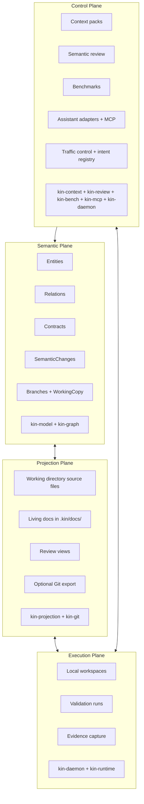
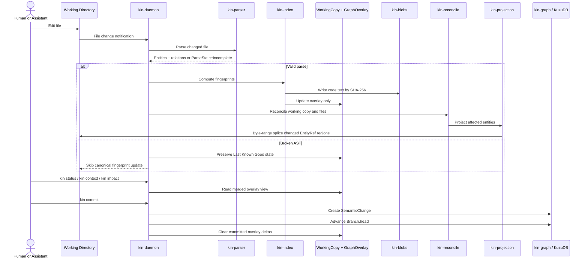
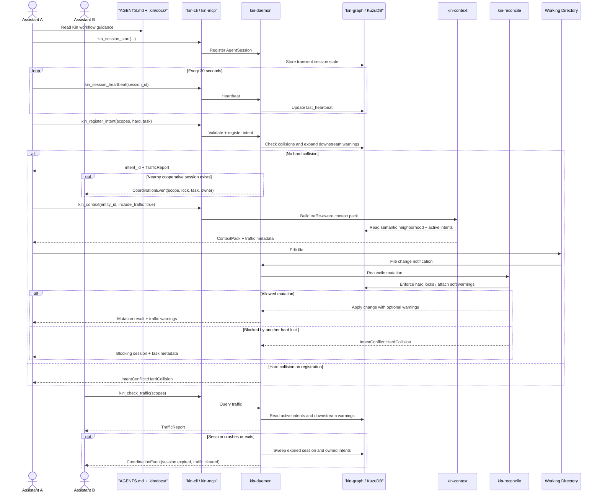
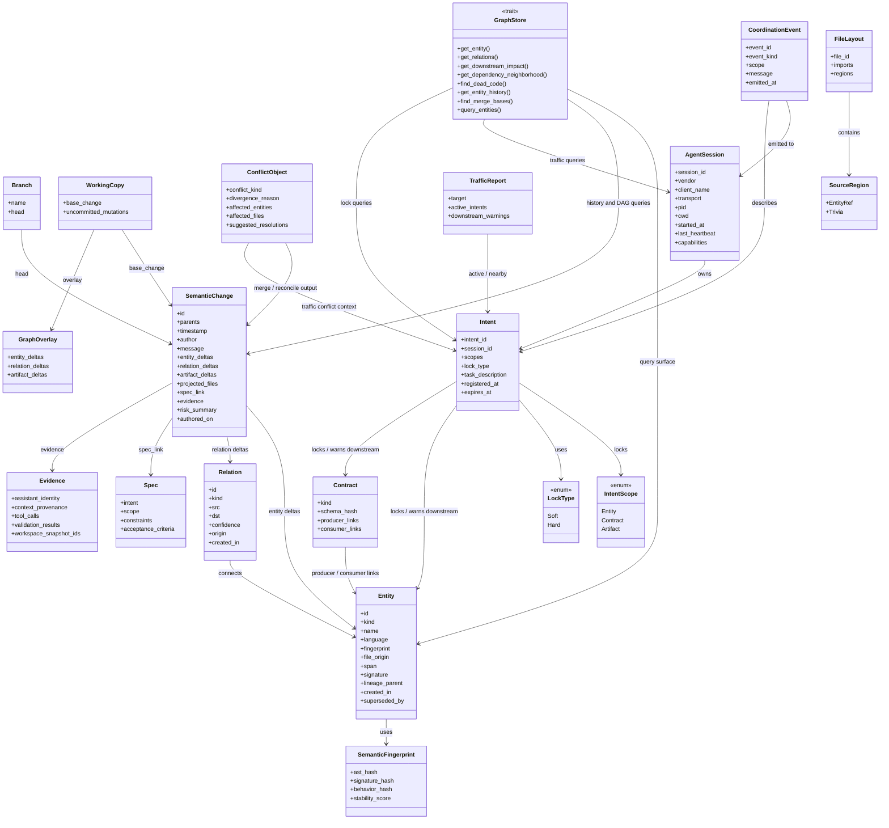
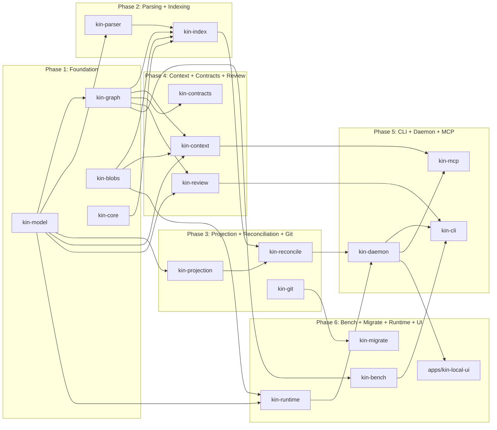

# Kin System Architecture

This document visualizes the **target V1 architecture** defined in [PLAN.md](../../PLAN.md) and the **Phase 7 assistant-coordination overlay** defined in [PLAN_P2.md](../../PLAN_P2.md).

It is intentionally comprehensive. Use it as the shared technical reference for implementation, review, and onboarding. If this document and `PLAN.md` ever diverge on V1, `PLAN.md` wins. If this document and `PLAN_P2.md` ever diverge on assistant coordination, `PLAN_P2.md` wins.

## 1. Master System Diagram

```mermaid
flowchart TB
  Dev["Human Developer"]
  Assistant["Assistant Clients<br/>Claude Code / Codex / Gemini / Cursor"]
  FileOnly["Non-cooperative File Tools<br/>plain editors / copilots"]
  GitWorld["Git Repos / GitHub<br/>Optional legacy interop"]

  subgraph Interfaces["Interface Layer"]
    CLI["kin-cli"]
    MCP["kin-mcp"]
    UI["apps/kin-local-ui"]
    Guide["AGENTS.md + .kin/docs/<br/>generated guidance"]
  end

  subgraph Orchestration["Daemon / Orchestration Layer"]
    DaemonSvc["kin-daemon<br/>API server, file watch, graph lifecycle"]
    Traffic["Agent traffic control<br/>sessions, intents, heartbeats,<br/>lock arbitration, notifications"]
    AdapterCfg["Assistant bootstrap<br/>adapter config + wrappers"]
  end

  subgraph WorkLoop["Working Copy + Reconciliation Loop"]
    Index["kin-index<br/>incremental indexing"]
    Parser["kin-parser<br/>Tree-sitter + language adapters"]
    WorkingCopy["WorkingCopy + GraphOverlay<br/>uncommitted semantic state"]
    Reconcile["kin-reconcile<br/>file <-> overlay reconciliation"]
    Projection["kin-projection<br/>CST-preserving projection"]
    Workdir["Working directory<br/>projected runnable files"]
  end

  subgraph Intelligence["Semantic Services"]
    Context["kin-context<br/>token-budgeted context packs"]
    Contracts["kin-contracts<br/>cross-language contract linking"]
    Review["kin-review<br/>semantic review + risk"]
    Runtime["kin-runtime<br/>validation runs + evidence"]
    Bench["kin-bench<br/>velocity, reliability, ROI"]
    Migrate["kin-migrate<br/>repo onboarding + history backfill"]
    GitAdapter["kin-git<br/>optional import / export / sync"]
  end

  subgraph Core["Semantic Core"]
    Model["kin-model<br/>canonical types + GraphStore trait"]
    Graph["kin-graph<br/>KuzuGraphStore"]
    Blobs["kin-blobs<br/>SHA-256 content store"]
    CoreSvc["kin-core<br/>.kin layout, config, init, errors"]
  end

  subgraph State["Local State (.kin/)"]
    Kuzu["graph/<br/>KuzuDB: entities, relations, contracts,<br/>SemanticChanges, branches, specs, evidence,<br/>transient sessions + intents"]
    Objects["objects/<br/>content-addressable blobs"]
    Journal["overlay.journal"]
    Stashes["stashes/"]
    Projections["projections/"]
    Docs["docs/<br/>living docs + assistant guidance"]
    Runs["runs/"]
    BenchData["bench/"]
    Logs["logs/"]
    Adapters["adapters/"]
  end

  Dev --> CLI
  Dev --> UI
  Assistant --> MCP
  Assistant --> Guide
  Assistant --> Workdir
  FileOnly --> Workdir
  GitWorld <--> GitAdapter

  CLI --> DaemonSvc
  MCP --> DaemonSvc
  UI --> DaemonSvc
  CLI --> AdapterCfg
  DaemonSvc --> AdapterCfg
  DaemonSvc <--> Traffic
  MCP <--> Traffic
  UI <--> Traffic
  AdapterCfg --> Guide

  DaemonSvc --> Index
  DaemonSvc --> Reconcile
  DaemonSvc --> Context
  DaemonSvc --> Contracts
  DaemonSvc --> Review
  DaemonSvc --> Runtime
  DaemonSvc --> Bench
  DaemonSvc --> Migrate

  Index --> Parser
  Parser --> WorkingCopy
  Index --> WorkingCopy
  Traffic --> Reconcile
  Traffic --> Context
  Traffic --> Review
  Reconcile <--> WorkingCopy
  Reconcile <--> Projection
  Projection <--> Workdir
  Workdir --> Index

  Traffic <--> Graph
  Context --> Graph
  Context --> Blobs
  Contracts <--> Graph
  Review --> Graph
  Runtime --> Graph
  Runtime --> Blobs
  Bench --> Graph
  Bench --> Blobs
  Migrate --> GitAdapter
  Migrate --> Graph
  Migrate --> Blobs

  Model -.-> Graph
  Model -.-> WorkingCopy
  Model -.-> Context
  Model -.-> Review

  Graph <--> Kuzu
  Blobs <--> Objects

  CoreSvc --> Kuzu
  CoreSvc --> Objects
  CoreSvc --> Journal
  CoreSvc --> Stashes
  CoreSvc --> Projections
  CoreSvc --> Docs
  CoreSvc --> Runs
  CoreSvc --> BenchData
  CoreSvc --> Logs
  CoreSvc --> Adapters
```

**Reading this diagram**

- Kin is **sovereign**: the semantic graph and `SemanticChange` DAG are primary, not Git.
- Git is present only through `kin-git`, which is a **legacy adapter**.
- The daemon owns runtime orchestration; the working copy loop keeps projected files and semantic state aligned.
- Cooperative assistants use CLI and MCP to register sessions, heartbeats, and intents before mutation.
- Non-cooperative file tools still work through the projected filesystem, but they bypass proactive intent coordination.
- The graph stores topology, history, and transient traffic state; the blob store stores content payloads.

## 2. Four Planes

**Plane responsibilities**

- The **semantic plane** is the source of truth.
- The **projection plane** renders runnable artifacts from semantic state.
- The **execution plane** proves correctness through real runs and evidence.
- The **control plane** manages retrieval, review, benchmarking, assistant access, and multi-agent coordination.

## 3. Working Copy and Commit Lifecycle

**Lifecycle rules**

- File edits update the **overlay**, not committed history.
- `kin commit` collapses overlay state into a new `SemanticChange`.
- Broken parses never overwrite canonical fingerprints or sever lineage.
- Projection is surgical: mutate entity byte ranges, preserve surrounding trivia.

## 4. Cooperative Agent Messaging Lifecycle

**Messaging rules**

- Cooperative clients establish an `AgentSession` first, then register intent before mutation.
- Heartbeats and reaping keep traffic state current without making it part of version history.
- Context, impact, review, and reconcile all become traffic-aware when the client cooperates through CLI or MCP.
- File-only tools remain compatible, but Kin can only detect their edits after the filesystem change lands.

## 5. Canonical Data Model

**Data model notes**

- `SemanticChange` is Kin's native commit object and the unit of history.
- `Branch.head` points to a `SemanticChange`; branches are refs, not embedded commit metadata.
- `WorkingCopy` is the branch head plus an uncommitted `GraphOverlay`.
- `AgentSession`, `Intent`, `TrafficReport`, and `CoordinationEvent` are transient coordination state from Phase 7.
- Intent traffic lives in KuzuDB for queryability, but it is not part of `SemanticChange`, Git export, or permanent repo history.
- `GraphStore` isolates KuzuDB behind typed Rust methods. No raw Cypher outside `kin-graph`.

## 6. Local State Layout

```mermaid
flowchart TB
  Root[".kin/"]
  Config["config.toml<br/>repo-local config"]
  Manifest["manifest.json<br/>repo identity, languages, adapters, Kin version"]
  GraphDir["graph/<br/>KuzuDB database files"]
  Objects["objects/<br/>SHA-256 blobs"]
  Journal["overlay.journal<br/>overlay crash recovery"]
  Stashes["stashes/<br/>overlay snapshots"]
  Projections["projections/<br/>generated projections"]
  Docs["docs/<br/>living docs + assistant guidance"]
  Bench["bench/<br/>benchmark traces and reports"]
  Runs["runs/<br/>validation evidence"]
  Logs["logs/<br/>daemon logs"]
  Adapters["adapters/<br/>assistant adapter config"]

  Root --> Config
  Root --> Manifest
  Root --> GraphDir
  Root --> Objects
  Root --> Journal
  Root --> Stashes
  Root --> Projections
  Root --> Docs
  Root --> Bench
  Root --> Runs
  Root --> Logs
  Root --> Adapters
```

**Storage rules**

- KuzuDB stores graph topology, signatures, fingerprints, history, and metadata.
- KuzuDB also stores transient agent sessions, intents, downstream warnings, and coordination events for local queryability.
- The blob store stores code text, projection outputs, evidence artifacts, and benchmark payloads.
- `.kin/docs/` may include generated assistant guidance and living docs emitted by `kin assistant install`.
- Deleting `.kin/` removes Kin state while leaving ordinary project files intact.

## 7. Crate Map by Architectural Responsibility

**Implementation reading**

- Phase order follows hard dependencies from the plan.
- `kin-model` is the foundation under nearly everything else.
- `kin-daemon` is the runtime hub for indexing, reconciliation, and API access.
- Phase 7 extends the existing crates rather than adding a parallel assistant subsystem.
- `apps/kin-local-ui` is an app surface on top of daemon APIs, not a separate source of truth.

## 8. Architecture Summary

- **Source of truth:** semantic graph plus `SemanticChange` DAG in KuzuDB
- **Content storage:** SHA-256 blob store on local disk
- **Uncommitted state:** `WorkingCopy` and `GraphOverlay`
- **Transient coordination state:** `AgentSession`, `Intent`, `TrafficReport`, and `CoordinationEvent`
- **Projection model:** CST-preserving byte-range splicing
- **Interop model:** Git is optional and isolated in `kin-git`
- **Assistant integration:** assistant-neutral MCP, CLI bootstrap, generated guidance, and local daemon APIs
- **Primary guarantee:** Kin remains local-first, sovereign, reversible, and runnable
