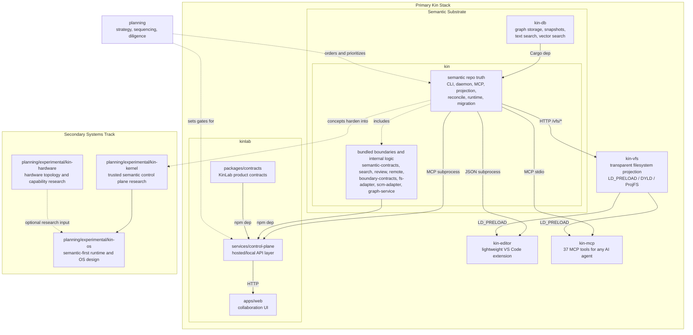

# The Kin Ecosystem: Semantic Substrate Thesis & Architecture Overview

This is the canonical source of truth for the Kin ecosystem.

Use this document when describing:

- what Kin is
- why the ecosystem exists
- how the active repos relate
- what the current product wedge is
- how the primary stack differs from the secondary systems track
- where work should go when repo boundaries are unclear

If another README, stack doc, roadmap summary, or ecosystem note disagrees, this document wins and the other document should be brought back into alignment.

## Part I: The Semantic Substrate Thesis

Kin is not primarily trying to build "an AI coding assistant" or "a new operating system."

The core thesis is that file-first, diff-first repositories are the wrong substrate for AI-native software work. For decades, computing has been optimized for human eyes: files, folders, lines of text, and diffs. That model works for people, but it forces machine intelligence to reconstruct the real structure of software over and over again from flattened artifacts.

The system of record should move from the line of text to the semantic logic node.

### 1. The Problem: The Re-parsing Tax

Today, AI systems repeatedly pay a tax that the substrate itself should eliminate.

- compute is wasted re-parsing text into trees, graphs, symbols, and relationships that should already exist as first-class truth
- context is fragmented because the substrate is structurally thin, so agents must rebuild state through RAG, grep, indexing overlays, and long transient context windows
- merge, review, blame, and trace are all biased toward file and line history rather than semantic identity and semantic impact

This is not just a UX problem. It is a systems-efficiency problem.

### 2. The Solution: Graph-First, Projection-Second

Kin reverses the traditional hierarchy.

- semantic truth is the system of record
- files, diffs, branches, PR-style views, and other familiar surfaces become projections and compatibility layers
- code, work, proof, provenance, intents, and relationships are attached to semantic objects rather than scattered across text, tickets, and memory

The important claim is not "better indexing."

The important claim is:

- the graph is not an overlay that tries to stay caught up with the filesystem
- the graph is the authoritative truth
- the filesystem becomes one projection of that truth

In the intended model, smaller and more local models should be able to traverse software reality directly instead of repeatedly reconstructing it from text.

### 3. Native Agent Coordination And Absolute State

Once semantic objects are the immutable anchors, coordination stops being a bolted-on afterthought.

- agents and humans can declare intent against semantic scopes instead of guessing through file ownership
- work, tests, notes, proof, and provenance can attach directly to the same semantic nodes
- concurrent actors can reason about actual scope overlap instead of colliding through line-diff artifacts
- status becomes less about "what files changed" and more about "what truth changed, why, and what else that change affects"

This is the broader shift:

- context becomes baked into the substrate
- coordination becomes native
- provenance becomes native
- proof becomes native

### 4. The Pragmatic Adoption Path

The ecosystem cannot demand an immediate hard fork of reality.

Adoption has to be survivable, which means the active stack must include:

- Git coexistence
- migration from existing Git and GitHub repositories
- editor integration
- agent integration
- hosted collaboration
- familiar compatibility surfaces while the new substrate proves itself

That is why the primary Kin business is not "new OS first."

The primary business is:

- replace the file-first, diff-first repo and collaboration substrate with a semantic one
- make that substrate materially better for humans and AI agents
- make migration survivable enough that real teams can adopt it

The OS, kernel, and hardware work are secondary systems research. They matter, but they should not outrun the primary stack.

## Part II: Ecosystem Architecture And Topology

The Kin ecosystem is divided into a primary stack and a secondary systems track.

- the primary stack is the pragmatic wedge used today
- the secondary systems track explores what happens if the same worldview eventually extends into runtime and hardware boundaries

### The Architecture Diagram

### How To Read The Diagram

- `kin-db` is the graph and retrieval substrate under the system
- `kin` is the semantic system of record and the center of gravity for the active wedge
- `kin-vfs` is the transparent filesystem projection layer — makes graph-backed files appear as normal files to any tool
- `kin-editor` is the lightweight VS Code extension
- `kin-mcp` exposes 37 semantic tools to any MCP-compatible AI agent
- `kinlab` is the shared collaboration and control-plane layer above local Kin
- `planning` sets sequence and gates
- `planning/experimental/` is the secondary systems track, not the current product wedge

### Integration Styles

The diagram edges carry labels that describe how components integrate:

| Label | Meaning |
|---|---|
| **Cargo dep** | Rust crate dependency compiled into the same binary (e.g. `kin-db` into `kin`) |
| **npm dep** | TypeScript/JavaScript package dependency resolved at build time |
| **subprocess** | The upstream component spawns the downstream binary as a child process |
| **MCP subprocess** | Integration via Model Context Protocol: the upstream spawns a `kin` MCP server subprocess and communicates over stdio JSON-RPC |
| **HTTP** | The control-plane serves the web app over HTTP |
| *(dashed, no label)* | Advisory or alignment relationship — no runtime coupling |

## Part III: The Primary Stack

The center of gravity is the primary stack. Everything else exists to support, prove, distribute, govern, or extend it.

| Part | What it is | What it owns | Main relationships |
|---|---|---|---|
| `kin` | Semantic system of record | repo truth, semantic history, projection, reconcile, runtime, CLI, daemon, MCP, migration, provenance, verification | built on `kin-db`; powers `kin-vfs`, `kin-editor`, `kin-mcp`, and `kinlab` |
| `kin-db` | Graph and search substrate | graph storage, snapshots, index/search primitives, vector retrieval substrate | sits below `kin` |
| `kin-vfs` | Virtual filesystem (CFS) | transparent graph-to-file projection via LD_PRELOAD/DYLD syscall interception, materialize-on-write | serves projections from `kin`; eliminates the need for editor forks |
| `kin-editor` | Lightweight VS Code extension | entity explorer, semantic search, trace, status bar (~500 LOC) | MCP-first with CLI fallback |
| `kin-mcp` | MCP server (37 semantic tools) | assistant-neutral integration for Claude, Cursor, Codex, Gemini | wraps `kin` runtime via MCP stdio |
| `kinlab` | Hosted collaboration and control plane | shared review, org memory, activity, remote status workflows, product UX, repo evaluation and rollout scoring | sits above `kin`; uses its own product contracts plus Kin-backed services |

### Adjacent Program Repos

These are important, but they are not equal flagship product surfaces.

| Part | Role |
|---|---|
| `planning` | strategy, sequencing, diligence, and ordered-program authority |
| `infra` | GCP infrastructure (Pulumi TS, GKE, GCS-backed snapshots) |

### Deep Dive: Inside `kin`

`kin` is not one crate with a CLI bolted on. It is the main local semantic platform.

#### Core Rust Foundation

- `kin/crates/kin-model`
  Canonical semantic data model.
- `kin/crates/kin-blobs`
  Content-addressable blob storage.
- `kin/crates/kin-core`
  Shared runtime, repo layout, and initialization.
- `kin/crates/kin-parser`
  Tree-sitter language parsing layer.
- `kin/crates/kin-index`
  Graph-build and re-index pipeline.

#### Semantic Workflow Crates

- `kin/crates/kin-projection`
  Projects semantic truth into file and document surfaces.
- `kin/crates/kin-reconcile`
  Pulls projected workspace changes back into semantic truth.
- `kin/crates/kin-context`
  Builds token-budgeted context packs for humans and agents.
- `kin/crates/kin-semantic-contracts`
  Semantic contract discovery and cross-language linking inside Kin itself.
- `kin/crates/kin-search`
  Proof-aware search ranking and explanation logic.
- `kin/crates/kin-review`
  Semantic review and gate-decision logic.
- `kin/crates/kin-remote`
  Native remote capability modeling and transport/publish logic.
- `kin/crates/kin-bench`
  Benchmarking and proof packaging.
- `kin/crates/kin-migrate`
  Git and GitHub brownfield import pipeline.
- `kin/crates/kin-runtime`
  Validation runs, execution, and evidence capture.

#### User-Facing Runtime Surfaces

- `kin/crates/kin-cli`
  The main local operator surface.
- `kin/crates/kin-daemon`
  Background service for status, sessions, intents, and local APIs.
- `kin/crates/kin-mcp`
  Assistant-neutral Model Context Protocol server.
- `kin/tests/integration`
  Cross-crate proof that Kin behaves as one system.

#### Bundled JS Boundary Packages

These live in `kin/packages/` because they are real active boundaries, but they are not top-level flagship repos.

- `kin/packages/boundary-contracts`
  Shared payload schemas and validation for cross-process boundaries.
- `kin/packages/fs-adapter`
  Headless workspace/filesystem bridge.
- `kin/packages/scm-adapter`
  Headless SCM/status/review snapshot bridge.
- `kin/packages/graph-service`
  Graph-facing workspace and projection service boundary.

### Deep Dive: User Surfaces And Collaboration

#### `kin-editor`

`kin-editor` is the lightweight VS Code extension (~500 LOC). It is MCP-first with CLI fallback: it keeps a persistent MCP connection to `kin mcp start` when available and falls back to spawning a CLI subprocess per command via `execFile()`.

It provides:

- Entity Explorer sidebar
- Semantic search
- Entity trace
- Status bar with entity count
- Graph overview

#### `kinlab`

`kinlab` is the monetizable shared layer above Kin.

It exists to provide a GitHub-shaped but Kin-native collaboration surface:

- shared semantic review
- org-wide search and memory
- activity and coordination
- native remote status and publish flows
- future governance, policy, and enterprise controls

Rule:

- shared ecosystem contracts live in `kin/packages/boundary-contracts`
- KinLab-specific product contracts live in `kinlab/packages/contracts`

That split prevents KinLab from silently forking the shared substrate contracts.

### Program Strategy

#### `planning`

`planning` is the strategy authority. It should answer:

- what has to be proved next
- what the real gates are
- what order the platform and product work should happen in

The canonical ordered tracker is [planning/strategy/master-checklist.md](/Users/troyfortinjr/GitHub/kin-ecosystem/planning/strategy/master-checklist.md).

## Part IV: The Secondary Systems Track (`planning/experimental/`)

These repositories represent the longer-horizon bootstrapping loop: use the efficient Kin tooling of today to engineer the more native semantic environment of tomorrow.

| Component | Purpose | Current state |
|---|---|---|
| `planning/experimental/kin-kernel` | Trusted semantic control plane for identity, sessions, intents, projections, capabilities, and transactions | starter API/types and `kind` daemon binary |
| `planning/experimental/kin-os` | Semantic-first runtime and OS design packaging the Kin model into a full operating environment | design and roadmap phase |
| `planning/experimental/kin-hardware` | Hardware topology and capability research for self-describing, policy-aware hardware graphs | starter device graph types and `kin-probed` binary |

### `planning/experimental/kin-kernel`

This repo explores the smallest trusted layer that could make the Kin worldview enforceable rather than advisory.

Owns:

- identity
- sessions
- intents
- capabilities
- projections
- semantic transactions
- evidence hooks

Current starter parts:

- `planning/experimental/kin-kernel/crates/kin-kernel-api`
- `planning/experimental/kin-kernel/crates/kind`

### `planning/experimental/kin-os`

This repo asks what happens if the Kin worldview becomes the runtime model rather than just the repository model.

Owns:

- end-state OS and product architecture
- deployment model
- runtime and userland design
- the path from the Kin substrate to a semantic-first operating environment

### `planning/experimental/kin-hardware`

This repo explores whether hardware can also be modeled semantically through capabilities, topology, trust boundaries, and constraints.

Current starter parts:

- `planning/experimental/kin-hardware/crates/kin-device-graph`
- `planning/experimental/kin-hardware/crates/kin-probed`

This is optional long-horizon research, not a requirement for the first useful version of the primary stack.

## Part V: Boundary Rules

Put work in `kin` when it changes:

- local semantic repo truth
- projections and reconcile
- CLI, daemon, or MCP behavior
- provenance, review, verification, or execution semantics
- bundled seam crates/packages under `kin/crates/*` or `kin/packages/*`

Put work in `kin-db` when it changes:

- graph internals
- search, index, or storage internals
- snapshot persistence
- text/vector retrieval internals

Put work in `kin/packages/boundary-contracts` when the job is:

- shared schema definition
- payload validation
- cross-process protocol alignment

Put work in `kin/crates/kin-remote` when the job is:

- remote capability modeling
- publish readiness
- sync, push, pull, or transport logic

Put work in `kinlab` when the value depends on:

- many users
- many repos
- org memory
- hosted collaboration
- governance, admin, or enterprise controls

Put work in `planning/experimental/kin-kernel`, `planning/experimental/kin-os`, or `planning/experimental/kin-hardware` only when the question is no longer "how should repositories and collaboration work" and has become:

- how should semantic policy be enforced across actors
- how should the runtime itself be shaped
- how should the operating environment or hardware model change

## Part VI: Ordered Vision, Public Narrative, And Release Posture

### Ordered Vision

1. Prove local semantic superiority in `kin` and `kin-db`.
2. Make the semantic substrate usable every day through `kin-editor`, `kin-vfs`, `kin-mcp`, and the bundled bridge layer in `kin`.
3. Make adoption survivable through migration, brownfield compatibility, and remote planning.
4. Build the hosted collaboration and control-plane layer in `kinlab`.
5. Add enterprise, operational, and proof packaging.
6. Only then push into `planning/experimental/kin-kernel`, `planning/experimental/kin-os`, and `planning/experimental/kin-hardware`.

### Public Narrative

If presenting the ecosystem publicly, lead with the stack like this:

1. `kin`
   The semantic system of record for software work.
2. `kin-editor`, `kin-vfs`, and `kin-mcp`
   The editor extension, virtual filesystem, and agent integration layer.
3. `kinlab`
   The hosted collaboration and control-plane layer.
Mention `kin-db` plus the bundled `kin` packages/crates as supporting layers.

Mention the OS, kernel, and hardware work as the secondary systems track, not as the current wedge.

### Release Posture

If the ecosystem is presented publicly, prefer this reduced shape:

- flagship repos:
  - `kin`
  - `kin-editor`
  - `kin-vfs`
  - `kinlab`
- supporting open repos:
  - `kin-db`
- bundled internal boundaries:
  - `kin/packages/boundary-contracts`
  - `kin/packages/fs-adapter`
  - `kin/packages/scm-adapter`
  - `kin/packages/graph-service`
  - `kin/crates/kin-semantic-contracts`
  - `kin/crates/kin-search`
  - `kin/crates/kin-review`
  - `kin/crates/kin-remote`
- secondary systems track:
  - `planning/experimental/kin-kernel`
  - `planning/experimental/kin-os`
  - `planning/experimental/kin-hardware`

Do not market a long list of internal seams as equal standalone products.

Market one system with a few clear surfaces.

## End-To-End Story

1. `kin-db` stores graph and retrieval state.
2. `kin` turns that into the semantic system of record for code, work, proof, review, and runtime coordination.
3. `kin-editor`, `kin-vfs`, and `kin-mcp` make that substrate usable for everyday editing and agent work.
4. `kinlab` turns local semantics into shared collaboration, control-plane, and future enterprise value.
5. `planning` keeps the order honest.
6. `planning/experimental/kin-kernel`, `planning/experimental/kin-os`, and `planning/experimental/kin-hardware` explore what happens if the same worldview eventually extends beyond repositories into runtime and hardware.

## Supporting Docs

This document is the canonical narrative and topology source. Supporting docs should stay narrower than this file.

Use:

- [stack-manifest.json](/Users/troyfortinjr/GitHub/kin-ecosystem/kin/docs/stack-manifest.json)
  and [compatibility-matrix.json](/Users/troyfortinjr/GitHub/kin-ecosystem/kin/docs/compatibility-matrix.json)
  for machine-readable stack topology
- [deployment.md](/Users/troyfortinjr/GitHub/kin-ecosystem/kin/docs/deployment.md)
  for deployment and hosting details
- [git-compatibility.md](/Users/troyfortinjr/GitHub/kin-ecosystem/kin/docs/git-compatibility.md)
  for Git coexistence and migration
