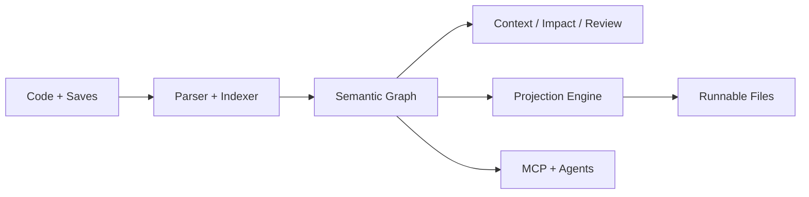

# Kin Deck

## 1. Cover

**Kin**  
**Semantic version control for AI-native teams**

Git was built for text history.  
Kin is built for code identity, agent context, and semantic change.

## 2. The Problem

Modern software teams are using agents on top of tooling that still thinks in files.

- Git knows lines, not logic
- blame breaks across moves and refactors
- review diffs are noisy when the real change is semantic
- context retrieval is expensive and imprecise
- monorepos are often a workaround for poor cross-boundary understanding

## 3. The Shift

Kin changes the source of truth:

- the graph stores semantic entities, relationships, contracts, and change history
- the blob store holds raw content
- files are projections for compatibility
- Git becomes an adapter, not the center of the system

## 4. What Developers Get

- `kin init` without requiring `.git`
- entity-level history, blame, diff, and impact analysis
- precise context packs for agents
- local-first workflows with normal runnable files
- optional Git import/export/sync for legacy interop

## 5. What Teams Get

- a real semantic review surface
- provenance across humans and agents
- better conflict detection than text merges
- a path out of monorepo sprawl without losing context
- a local-first substrate that can grow into shared org intelligence

## 6. Why Contributors Should Care

Kin is a rare systems project with real leverage:

- Rust core
- KuzuDB graph engine
- Tree-sitter parsing
- byte-accurate projection
- assistant-neutral MCP integration
- cross-language identity tracking

This is infrastructure work with a product surface people can feel immediately.

## 7. Why Kin Wins

Other tools bolt AI onto file-based repositories.

Kin starts from the opposite premise:

- code has identity beyond file paths
- change should be tracked at the semantic level
- context should be queryable, not guessed
- AI agents need coordination, traffic, and proof, not bigger prompts

## 8. Open-Core Wedge

The open core is the local-first semantic VCS:

- CLI
- daemon
- MCP server
- local UI
- graph, parser, projection, reconcile, context, review, and Git adapter

That is the adoption wedge.

## 9. Commercial Horizon

The proprietary layer is not “Git, but paid.”
It is the federated layer above the local core:

- org graph federation
- shared review and coordination
- governance and fleet visibility
- hosted control planes

## 10. Closing

**Git solved text history.  
Kin is solving code understanding.**

If developers and agents are going to build software together, the repository has to become semantic.
